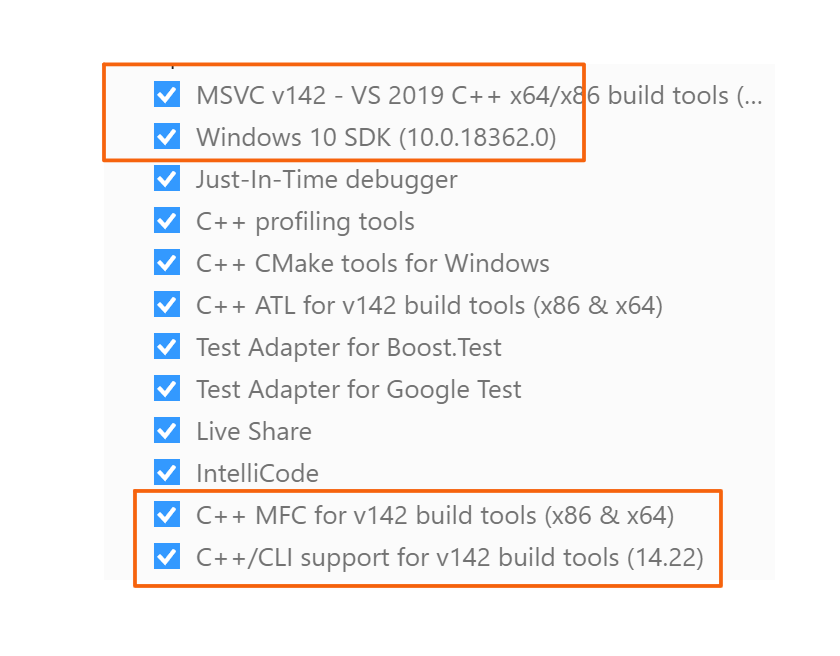

# Non-Verbal Smart Home Recognition (NVSHR) System 

### Environment Set-Up

 If you are using a Windows machine, please check and make sure you are using the current SDK files.
 You can most likely find these files in your C directory (C:\Program Files (x86)\Microsoft SDKs\Windows Kits) or similar directory.
 If the SDKs are missing, you can download them from the official Windows website (https://developer.microsoft.com/en-us/windows/downloads/windows-10-sdk) or install the tool kits via Visual Studio Installer.
 
 
 For Windows machines, please follow these steps to set up your environment for the NVSHR System:

1. Install Python3.7 (https://www.python.org/downloads/)

2. Once Python3.7 has finished downloading, open a command prompt and install the package needed for this project by running the following commands:
   + `pip install numpy`
   + `pip install opencv-python`
   + `pip install Cmake`
   + `pip install dlib`
   
   These libraries are needed for the NVSHR System to properly run on your machine. 

3. Once all the needed libraries are finished downloading, run `environment_test.py` in the root directory.
   The following output indicates that the correct libraries were downloaded (Minor differences in version numbers will not cause issues): 
    + Version of numpy is: 1.17.2
    + Version of OpenCV is: 4.1.1
    + Version of dlib is: 19.17.0
    + Version of imutils is: 0.5.3
    
 For Mac machines, please follow these steps to set up your environment for the NVSHR System:

1. Install Homebrew (https://docs.brew.sh/Installation)

2. Once Homebrew is finished installing, please run the following commands to download the latest version of Python and pip:
   + `brew install python`
   + `sudo easy_install pip`

3. Once Python and pip have finished downloading, open a command prompt and install the packages needed for this project by running the following commands:
   + `pip install numpy`
   + `pip install opencv-python`
   + `pip install Cmake`
   + `pip install dlib`
   
   These libraries are needed for the NVSHR System to properly run on your machine. 

4. Once all the needed libraries are finished downloading, run `environment_test.py` in the root directory.
   The following output indicates that the correct libraries were downloaded (Minor differences in version numbers will not cause issues): 
    + Version of numpy is: 1.17.2
    + Version of OpenCV is: 4.1.1
    + Version of dlib is: 19.17.0
    + Version of imutils is: 0.5.3

### Intializing the NVSHR System

Pass an argument into main.py to set the number of seconds between ticks (default is 3).

Everything is sketchy and broken right now, but it does run. Logs "tick" every tick, "fist" if it detected a fist in the last tick, "palm" if it detected a palm with spread out fingers, "left wink" if it detected the left eye winking, and "right wink" if it detected the right eye winking.

GestureDetector has a bunch of repeating code in it, and we obvious need to abstract that stuff out into a separate class called Gesture.

Timer probably doesn't belong in GestureDetector as far as code structure is concerned, but our frame processing loop in GestureDetector is currently blocking, so we can't have an asynchronous loop running at the same time. We should probably eventually make that frame processing loop asynchronous and then handle the timer loop in a different file.
